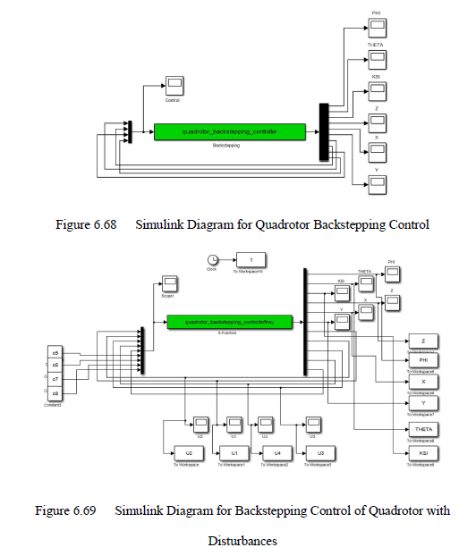
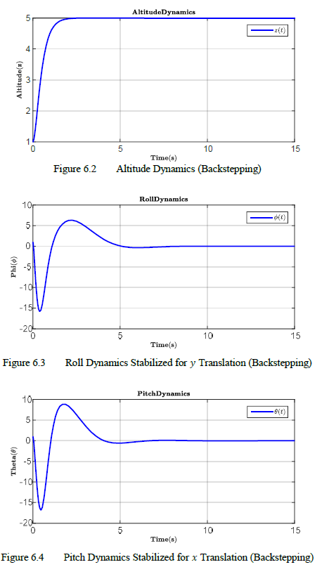

# Backstepping Controller

## Introduction

Backstepping is a Nonlinear controller based on Lyapunov functions. Four controllers are developed for the Altitude, Yaw, Pitch, and Roll attitudes of the quadrotor. 

## Description

## Results

